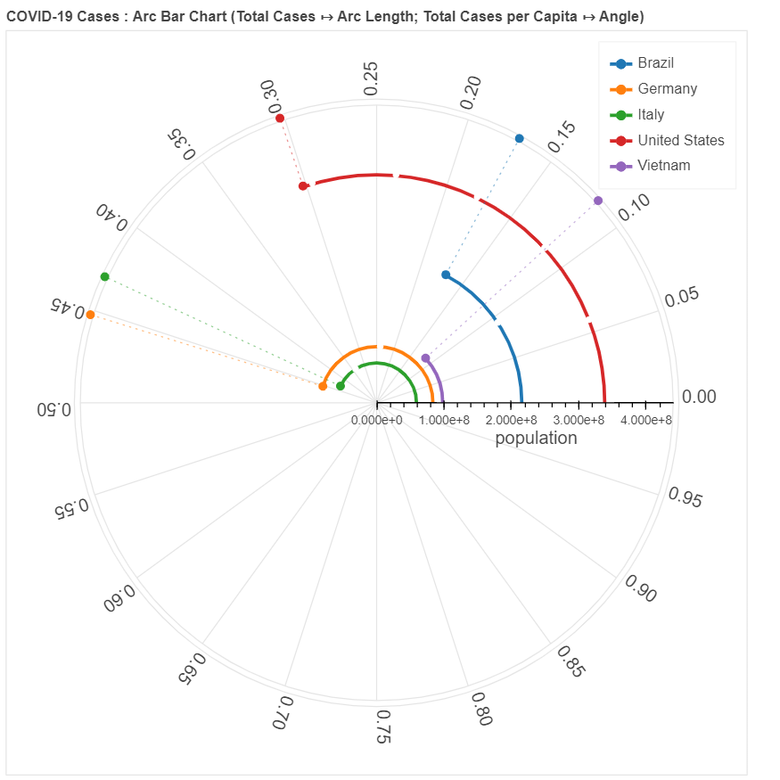

# Arc Bar Chart : Combined Visual Encoding of Absolute and Fractional Values

While visualizing a quantity, one often has to choose between:

- **Absolute Values**: Gives you a sense of scale.
- **Fractional Values** (/Percentage/per million/etc.): Makes values easier to compare and comprehend.

Choosing one implies losing benefits of the other. But what if we want to retain benefits of both in a single chart ?

This was the problem I wanted to solve while working on my COVID-19 Dashboard (Part of the Enterprise Data Science Master's Course). Comparing the deaths per million of countries with widely different population sizes seemed unfair. Even a 1% increase in death rate of a country with a large population is a lot more deaths when compared to a 1% increase in a country of population of several thousands. By combining the two values (absolute and fractional) in a way that is intuitive for the user, we give the user a more "complete" overview of the situation.

The arc bar chart was implemented based on the similarity of two simple equations:

## Fractional Value = Absolute Value / Total Value

## Arc Angle = Arc Length / Radius

For example: the following chart shows both the Absolute Values (Total Cases) as well as Fractional Values (Total Cases per Capita) of 5 countries:

In the example above, the arc for each country is subdivided into smaller arcs (sub-arcs). Each of these sub-arcs represents 20 Million Cases or less (in case of end sub-arc).

### Some of the problems with using Arc Bar Chart

- When "Total Values" (in our example: "Population") is almost equal for many, it will cause overdraw.
- When the ratio of max("Total Values"):min("Total Values") is too high, some of the arcs with low "Total Value" will look like a dot in the centre.
- When max("Fractional Values") is too low, arc bar chart can be very difficult to read and if "sliced" can have a very high aspect ratio.
- The shape of the plot is restricted a square. (Exceptions: When using Slicing)
- New chart type -> Unfamilliar to users -> Need to dedicate extra time when using for the first time.

### Possible Future Improvements

- Slicing: Based on max("Fractional Values"), the circle can be sliced down to a semi-circle/quarter-circle or a pie.
- Adding a "Donut" Verion of the Chart based on range of "Total Values"
- Adding features related to a traditional bar chart, for example stacking, highlighting change, etc.

### Version History

- Version 1 (24/07/2022):
  - Added a basic version of Arc Bar Chart (Previously called Circular Bar Char)
  - Added as a part of eds-covid repository
- Version 2 (31/01/2023):
  - Created a separate repository for Arc Bar Chart
  - Made it easier for the user to comprehend the absolute value by:
    - Dividing the arcs into smaller arcs (sub-arcs)
    - Adding option for the user to add Absolute Value Spiral Grid Lines
  - Added the Outer Ring with Frational Tick Labels
  - Converted the bar chart to a "Lollipop Chart"
  - The end points of the lollipops interpolated to the outer ring for easier comprehension of the fractional values.
  - and some Minor Improvements and Bug fixes.
